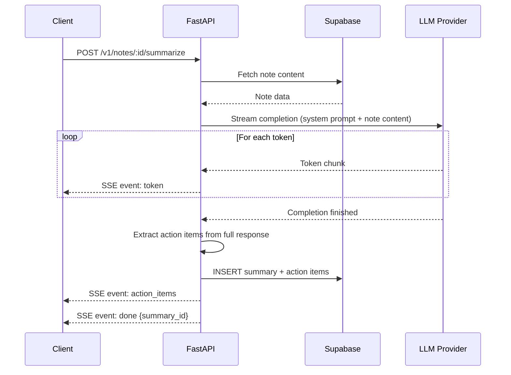
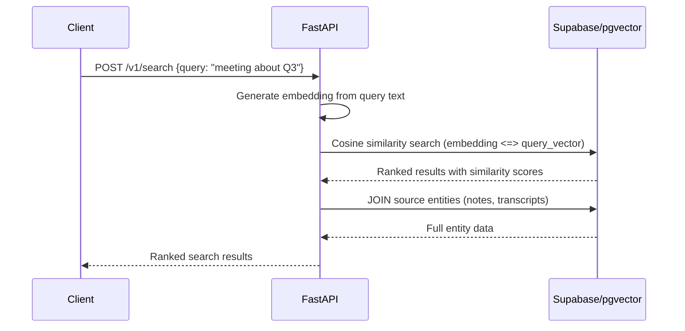

# AI Integration Architecture

## Design Principle

AI is a backend concern. No client ever calls an AI provider directly. This gives us:

- API key isolation (keys never leave the server)
- Provider switching without client updates
- Usage tracking and rate limiting in one place
- Response caching potential
- Consistent error handling

## Provider Abstraction

```python
# apps/api/app/services/ai/base.py
from abc import ABC, abstractmethod
from typing import AsyncIterator

class LLMProvider(ABC):
    @abstractmethod
    async def complete(self, prompt: str, system: str = "") -> str:
        """Single-shot completion."""

    @abstractmethod
    async def stream(self, prompt: str, system: str = "") -> AsyncIterator[str]:
        """Streaming completion, yields tokens."""

    @abstractmethod
    async def embed(self, text: str) -> list[float]:
        """Generate embedding vector."""


class TranscriptionProvider(ABC):
    @abstractmethod
    async def transcribe(self, audio_bytes: bytes, mime_type: str) -> TranscriptResult:
        """Transcribe audio to text."""
```

Concrete implementations:

| Provider | Class | Used For |
|----------|-------|----------|
| OpenAI | `OpenAIProvider` | GPT-4o-mini (summarization), text-embedding-3-small |
| Groq | `GroqProvider` | Llama 3 (fast summarization alternative) |
| Gemini | `GeminiProvider` | Gemini Flash (cost-effective option) |
| Whisper | `WhisperProvider` | Audio transcription |

Provider selection is config-driven:

```python
# apps/api/app/core/config.py
class Settings(BaseSettings):
    llm_provider: Literal["openai", "groq", "gemini"] = "openai"
    llm_model: str = "gpt-4o-mini"
    embedding_provider: Literal["openai"] = "openai"
    embedding_model: str = "text-embedding-3-small"
    transcription_provider: Literal["openai"] = "openai"
    transcription_model: str = "whisper-1"
```

Switching providers requires only a config change. No client update needed.

## Summarization Flow



### System Prompt (Summarization)

```
You are a productivity assistant. Summarize the following note concisely.

After the summary, extract any action items as a JSON array.

Rules:
- Summary should be 2-5 sentences
- Action items must be concrete and actionable
- Assign priority: low, medium, high
- If no action items exist, return empty array

Output format:
[summary text]

---ACTION_ITEMS---
[{"text": "...", "priority": "..."}]
```

The response is parsed after streaming completes to extract the structured action items. Streaming gives the user immediate feedback (summary text appears token-by-token), then action items are extracted and sent as a single `action_items` event.

## Semantic Search Flow



### Search Request

```json
POST /v1/search
{
  "query": "meeting about Q3 roadmap",
  "limit": 10,
  "threshold": 0.7,
  "source_types": ["note", "transcript"]
}
```

### Search Response

```json
{
  "data": {
    "results": [
      {
        "source_type": "note",
        "source_id": "uuid",
        "title": "Q3 Planning Meeting",
        "snippet": "...discussed Q3 roadmap priorities...",
        "similarity": 0.92
      }
    ]
  }
}
```

## Embedding Generation

Embeddings are generated asynchronously after content creation/update:

1. Note created or content updated → API generates embedding
2. Transcript created → API generates embedding
3. Long content is chunked (max 500 tokens per chunk) with 50-token overlap
4. Each chunk gets its own embedding row with `chunk_index`
5. Old embeddings are deleted and regenerated on content update

### Chunking Strategy

```python
def chunk_text(text: str, max_tokens: int = 500, overlap: int = 50) -> list[str]:
    """Split text into overlapping chunks for embedding."""
    words = text.split()
    chunks = []
    start = 0
    while start < len(words):
        end = start + max_tokens
        chunk = " ".join(words[start:end])
        chunks.append(chunk)
        start = end - overlap
    return chunks
```

Token estimation uses word count (1 word ≈ 1.3 tokens). This is imprecise but sufficient — embedding models handle slightly over-size inputs gracefully.

## Voice Memo Pipeline

```
Record (mobile) → Upload to Supabase Storage → Trigger transcription → Store transcript → Generate embedding → Optional: summarize transcript
```

### Supported Formats

| Format | MIME | Max Duration | Max Size |
|--------|------|-------------|----------|
| WebM | audio/webm | 30 min | 25 MB |
| M4A | audio/mp4 | 30 min | 25 MB |
| WAV | audio/wav | 10 min | 50 MB |

Whisper API accepts up to 25 MB. Files exceeding this are rejected at upload time.

### Transcription Request

```python
async def transcribe(self, audio_bytes: bytes, mime_type: str) -> TranscriptResult:
    response = await self.client.audio.transcriptions.create(
        model="whisper-1",
        file=("audio", audio_bytes, mime_type),
        response_format="verbose_json",
        language="en"  # or auto-detect
    )
    return TranscriptResult(
        content=response.text,
        language=response.language,
        confidence=getattr(response, 'confidence', None),
        duration=getattr(response, 'duration', None)
    )
```

## Error Handling

AI operations fail more often than CRUD operations. The strategy:

| Failure | Handling |
|---------|----------|
| Provider timeout (30s) | Retry once, then fail with SSE `error` event |
| Rate limit (429) | Respect `Retry-After`, queue for later processing |
| Invalid response format | Log, return partial result if possible |
| Content too long for context window | Chunk and summarize each chunk, then summarize summaries |
| Provider down | Return 503 with estimated retry time |

Client-side: SSE `error` events show a toast notification. The user can retry manually.

## Cost Awareness

All AI operations track token usage:

```python
@dataclass
class AIUsage:
    provider: str
    model: str
    input_tokens: int
    output_tokens: int
    estimated_cost_usd: float
    operation: str  # "summarize", "embed", "transcribe"
    timestamp: datetime
```

Usage is logged (not stored in DB in Phase 1). This data informs:
- Whether to switch to cheaper providers
- When to implement caching
- Monthly cost projections

## Caching (Phase 2)

Not implemented in Phase 1, but designed for:

- **Embedding cache:** Don't re-embed unchanged content (compare content hash)
- **Summary cache:** Don't re-summarize unchanged notes (compare content hash + model version)
- **Search cache:** Cache frequent query embeddings (LRU, 1hr TTL)

## Assumptions

1. All AI calls are user-initiated in Phase 1 (no background processing)
2. English-only for Phase 1 transcription
3. Single embedding model per deployment (no mixed-model indexes)
4. Summarization context window is sufficient for individual notes (<8K tokens typically)
5. No fine-tuned models — using off-the-shelf APIs only
