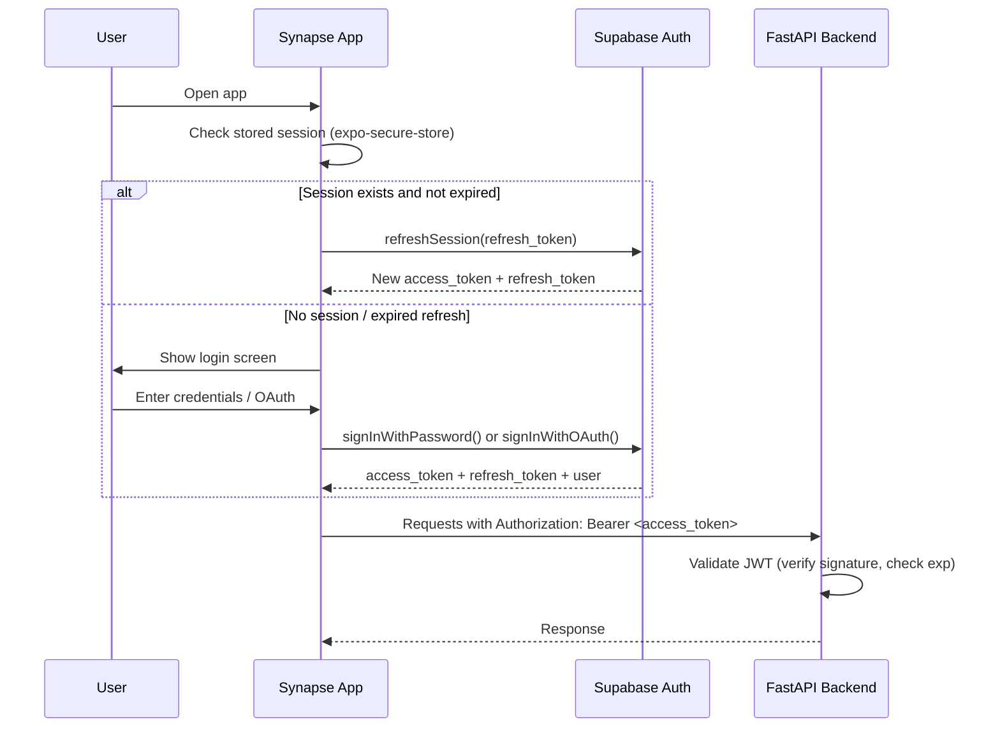
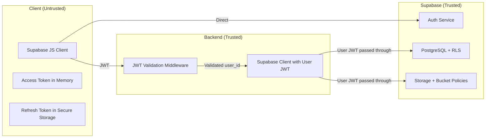

# Authentication & Row-Level Security

## Overview

Synapse delegates authentication to Supabase Auth and enforces data isolation through PostgreSQL Row-Level Security (RLS). The backend (FastAPI) validates JWTs but never stores credentials. This document defines the auth flow, RLS policy design, and security boundaries.

## Authentication Flow

### Client-Side (Expo / React Native Web)



### Supported Auth Methods (Phase 1)

| Method | Provider | Notes |
|--------|----------|-------|
| Email + Password | Supabase Auth | Primary method. Email confirmation required |
| Google OAuth | Supabase Auth (Google provider) | One-tap on mobile, redirect on web |
| Magic Link | Supabase Auth | Email-based passwordless login |

**Phase 2 consideration:** Apple Sign-In (required for iOS App Store if any social login is offered).

### Token Lifecycle

| Token | Lifetime | Storage | Refresh Strategy |
|-------|----------|---------|-----------------|
| Access token (JWT) | 1 hour | In-memory (JS variable) | Auto-refresh via Supabase client when < 5 min remaining |
| Refresh token | 7 days | `expo-secure-store` (mobile), `httpOnly` cookie (web) | Used to obtain new access token |

**Critical rules:**
1. Access tokens are NEVER persisted to disk on mobile — only held in memory
2. Refresh tokens use platform-secure storage (Keychain on iOS, Keystore on Android)
3. On web, Supabase JS client manages tokens via its built-in cookie/localStorage strategy
4. Token refresh happens automatically via `supabase.auth.onAuthStateChange()` listener

### Offline Auth Behavior

When the device is offline:
1. Cached access token continues to be used for local-only operations (no API calls needed)
2. If access token expires while offline, local operations continue — token refresh is queued
3. On connectivity resume: refresh token is used to get new access token BEFORE sync queue processes
4. If refresh token is also expired: user is redirected to login

## Backend JWT Validation

FastAPI validates every request (except `/v1/health`) via a dependency:

```python
# app/dependencies/auth.py
from jose import jwt, JWTError
from fastapi import Depends, HTTPException, status
from fastapi.security import HTTPBearer, HTTPAuthorizationCredentials

security = HTTPBearer()

async def get_current_user(
    credentials: HTTPAuthorizationCredentials = Depends(security),
) -> dict:
    try:
        payload = jwt.decode(
            credentials.credentials,
            settings.SUPABASE_JWT_SECRET,
            algorithms=["HS256"],
            audience="authenticated",
        )
        user_id = payload.get("sub")
        if not user_id:
            raise HTTPException(status_code=401, detail="Invalid token: no sub claim")
        return {"user_id": user_id, "email": payload.get("email")}
    except JWTError:
        raise HTTPException(status_code=401, detail="Invalid or expired token")
```

**Validation checks:**
1. Signature verification against `SUPABASE_JWT_SECRET`
2. `exp` claim — reject expired tokens
3. `aud` claim — must be `"authenticated"`
4. `sub` claim — must exist and becomes `user_id` for all downstream queries

**The backend never:**
- Stores passwords or credentials
- Issues its own tokens
- Manages sessions
- Calls Supabase Auth admin APIs (Phase 1)

## Row-Level Security (RLS)

### Design Principle

Every table containing user data has RLS enabled. Policies ensure users can only access their own rows. The backend connects to Supabase with the user's JWT (not a service role key), so RLS is enforced even for backend queries.

### Policy Pattern

All user-owned tables follow the same policy template:

```sql
-- Enable RLS
ALTER TABLE notes ENABLE ROW LEVEL SECURITY;

-- Users can only see their own rows
CREATE POLICY "Users can view own notes"
  ON notes FOR SELECT
  USING (user_id = auth.uid());

-- Users can only insert rows for themselves
CREATE POLICY "Users can create own notes"
  ON notes FOR INSERT
  WITH CHECK (user_id = auth.uid());

-- Users can only update their own rows
CREATE POLICY "Users can update own notes"
  ON notes FOR UPDATE
  USING (user_id = auth.uid())
  WITH CHECK (user_id = auth.uid());

-- Users can only delete (soft) their own rows
CREATE POLICY "Users can delete own notes"
  ON notes FOR DELETE
  USING (user_id = auth.uid());
```

### RLS Policy Map

| Table | SELECT | INSERT | UPDATE | DELETE | Special Rules |
|-------|--------|--------|--------|--------|---------------|
| `notes` | Own rows | Own rows | Own rows | Own rows | — |
| `tasks` | Own rows | Own rows | Own rows | Own rows | — |
| `voice_memos` | Own rows | Own rows | Own rows | Own rows | — |
| `transcripts` | Own rows | Own rows | Own rows | Own rows | Immutable after creation (app-level, not RLS) |
| `summaries` | Own rows | Own rows | Own rows | Own rows | — |
| `embeddings` | Own rows | Own rows | Own rows | Own rows | — |

All policies use `auth.uid()` which extracts the `sub` claim from the JWT in the current session.

### Service Role Key Usage

| Context | Key Used | RLS Enforced |
|---------|----------|-------------|
| Client → Supabase direct (Realtime, Auth) | Anon key + user JWT | Yes |
| Backend → Supabase (normal queries) | Anon key + user JWT (passed through) | Yes |
| Backend → Supabase (migrations, admin) | Service role key | No (bypasses RLS) |
| Backend → Supabase (background jobs) | Service role key | No — must add `WHERE user_id = ?` manually |

**Rule:** The service role key is ONLY used for:
1. Database migrations
2. Background jobs that need cross-user access (e.g., cleanup of expired soft-deleted rows)
3. NEVER in request-handling code paths

### Supabase Storage RLS

Voice memo audio files are stored in Supabase Storage with bucket-level policies:

```sql
-- voice-memos bucket
CREATE POLICY "Users can upload own memos"
  ON storage.objects FOR INSERT
  WITH CHECK (
    bucket_id = 'voice-memos'
    AND (storage.foldername(name))[1] = auth.uid()::text
  );

CREATE POLICY "Users can read own memos"
  ON storage.objects FOR SELECT
  USING (
    bucket_id = 'voice-memos'
    AND (storage.foldername(name))[1] = auth.uid()::text
  );
```

Files are stored at path `voice-memos/{user_id}/{memo_id}.{ext}`, so the folder-based policy ensures isolation.

## Security Boundaries Summary



## Tradeoffs

| Decision | Upside | Downside |
|----------|--------|----------|
| JWT pass-through (not service key) for backend queries | RLS enforced at DB level, defense in depth | Cannot query across users in normal request flow |
| 1-hour access token lifetime | Limits window if token is leaked | More frequent refresh needed |
| No custom auth server | Less infrastructure to manage | Locked into Supabase Auth feature set |
| RLS on all tables | Data isolation guaranteed at DB level | Slight query overhead; every query filtered |

## Assumptions

1. Single-user accounts only — no team/org sharing in Phase 1
2. Supabase Auth handles email verification, password reset, OAuth flows
3. RLS policies are sufficient for data isolation (no application-level access checks needed beyond `user_id`)
4. Service role key is stored as environment variable, never exposed to client
