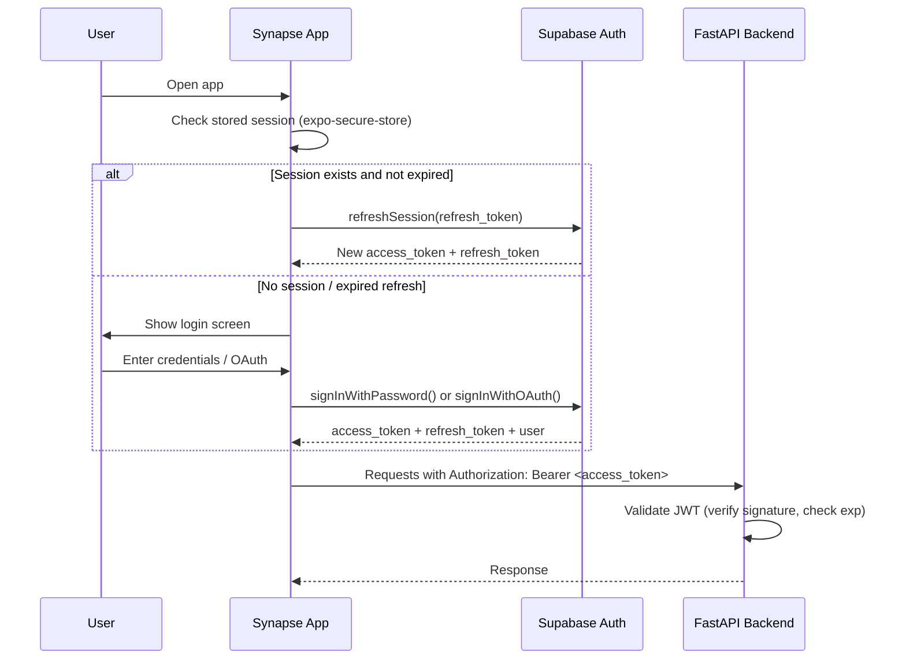
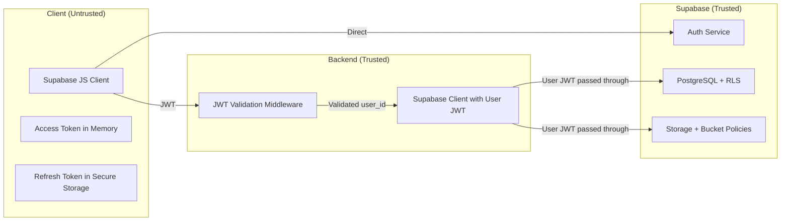

# Authentication & Row-Level Security

## Overview

Synapse delegates authentication to Supabase Auth and enforces data isolation through PostgreSQL Row-Level Security (RLS). The backend (FastAPI) validates JWTs but never stores credentials. This document defines the auth flow, RLS policy design, and security boundaries.

## Wave 2 Implementation Contract

Auth is implemented as a narrow boundary:

- `apps/mobile` owns sign-in, sign-out, token refresh, and secure refresh-token storage.
- `apps/api` owns bearer-token validation and maps the JWT `sub` claim to `current_user.user_id`.
- Supabase Postgres owns data isolation through RLS; API code must still include `user_id` filters for clarity and defense in depth.
- Service-role access is migration/admin-only unless a background job is explicitly documented and scoped by `user_id`.

Minimum enforcement before feature work:

| Area | Requirement |
|------|-------------|
| API auth | Every `/v1/*` route except `/v1/health` and `/v1/version` depends on the auth boundary |
| RLS | Every user-owned table has `SELECT`, `INSERT`, `UPDATE`, and soft-delete policies |
| Storage | Voice memo object paths start with `{user_id}/` and bucket policies verify that prefix |
| Tests | API tests cover unauthenticated access, cross-user reads, cross-user writes, and storage path rejection |
| Logs | Auth failures log `request_id` and reason category, never token contents or email addresses |

Implementation order:

1. Create tables with `user_id`, `version`, timestamps, and `is_deleted` where applicable.
2. After explicit migration approval and security review, require RLS in the
   same minimal migration that creates each user-owned table.
3. Add route dependencies and repository helpers that require `current_user`.
4. Add tests proving user A cannot read or mutate user B data through the API or direct Supabase client.

The Notes-specific migration, RLS, auth dependency, and repository replacement
plan is documented in
[notes-persistence-auth-integration-plan.md](../notes-persistence-auth-integration-plan.md).
The selected live integration sequence and verifier/client decisions are in
[notes-live-auth-supabase-plan.md](../notes-live-auth-supabase-plan.md).
Database artifact restrictions and the future migration approval gate are in
[database-migration-policy.md](../security/database-migration-policy.md).

Slice 6E implementation status:

- Notes routes now depend on `get_auth_context` instead of a route-local
  `dev_user` constant.
- Local/test mode remains `SYNAPSE_AUTH_MODE=dev` and returns
  `AuthContext(user_id="dev_user", auth_mode="dev")` unless overridden.
- JWT validation is isolated behind the auth dependency but remains deferred;
  `jwt` mode currently rejects requests rather than accepting unverified tokens.
- The Notes repository boundary exists with a memory default and a Supabase
  scaffold that requires a future injected user-scoped client.
- No executable Supabase migration is currently committed. Notes table,
  soft-delete/version, index, and RLS intent is architecture documentation only.

Slice 6G hardening status:

- Supported API auth modes are explicit: `dev` and `jwt`.
- `dev` mode is deterministic and intended only for local development and tests.
  It must not be used in production deployments.
- Unknown `SYNAPSE_AUTH_MODE` values now fail closed with `401 UNAUTHORIZED`
  instead of falling back to `dev`.
- `jwt` mode requires an `Authorization: Bearer <token>` header shape, rejects
  missing or malformed authorization headers, and rejects placeholder/fake tokens
  while full JWT verification remains deferred.
- `jwt` mode does not require live Supabase in CI; without verifier/config it
  fails closed rather than accepting requests.

## Authentication Flow

### Client-Side (Expo / React Native Web)



### Supported Auth Methods (Phase 1)

| Method | Provider | Notes |
|--------|----------|-------|
| Email + Password | Supabase Auth | Primary method. Email confirmation required |
| Google OAuth | Supabase Auth (Google provider) | One-tap on mobile, redirect on web |
| Magic Link | Supabase Auth | Email-based passwordless login |

**Phase 2 consideration:** Apple Sign-In (required for iOS App Store if any social login is offered).

### Token Lifecycle

| Token | Lifetime | Storage | Refresh Strategy |
|-------|----------|---------|-----------------|
| Access token (JWT) | 1 hour | In-memory (JS variable) | Auto-refresh via Supabase client when < 5 min remaining |
| Refresh token | 7 days | `expo-secure-store` (mobile), `httpOnly` cookie (web) | Used to obtain new access token |

**Critical rules:**
1. Access tokens are NEVER persisted to disk on mobile — only held in memory
2. Refresh tokens use platform-secure storage (Keychain on iOS, Keystore on Android)
3. On web, Supabase JS client manages tokens via its built-in cookie/localStorage strategy
4. Token refresh happens automatically via `supabase.auth.onAuthStateChange()` listener

### Offline Auth Behavior

When the device is offline:
1. Cached access token continues to be used for local-only operations (no API calls needed)
2. If access token expires while offline, local operations continue — token refresh is queued
3. On connectivity resume: refresh token is used to get new access token BEFORE sync queue processes
4. If refresh token is also expired: user is redirected to login

## Backend JWT Validation

Target state: FastAPI validates every authenticated request through an injected
verifier boundary. The selected default is local verification of asymmetric
Supabase access tokens against the project JWKS endpoint, using a bounded cache
and refresh on an unknown key id. This avoids placing a Supabase Auth user lookup
in every request path and supports signing-key rotation.

Validation checks:

1. Verify the signature using a configured asymmetric algorithm allowlist and
   JWKS in the default mode.
2. Validate `exp`, issuer, and the configured audience (`authenticated` by
   default).
3. Require a non-empty UUID `sub`, which becomes `AuthContext.user_id`.
4. Retain the verified access token only for construction of the user-scoped
   Data API client.
5. Reject every failure with a coarse `401 UNAUTHORIZED` envelope and never log
   token content.

HS256 validation using `SUPABASE_JWT_SECRET` is allowed only in an explicitly
configured legacy compatibility mode. It is not a fallback from JWKS mode, and
unsigned tokens are never accepted.

**The backend never:**
- Stores passwords or credentials
- Issues its own tokens
- Manages sessions
- Calls Supabase Auth admin APIs (Phase 1)

Current implementation note: Slice 6G does not add a JWT library or live
Supabase verifier. The `jwt` branch exists as a fail-closed boundary until
`Slice 6H-1 - JWT verifier interface and tests` implements this decision.

## Row-Level Security (RLS)

### Design Principle

Every table containing user data has RLS enabled. Policies ensure users can only access their own rows. The backend connects to Supabase with the user's JWT (not a service role key), so RLS is enforced even for backend queries.

### Policy Pattern

User-owned tables should enforce ownership through `auth.uid()` if a future
minimal migration is approved. For Notes, reads, inserts, updates, and
soft-deletes are limited to rows owned by the caller; Notes CRUD does not expose
a physical-delete operation. This describes the intended outcome, not an
executable policy artifact.

### RLS Policy Map

| Table | SELECT | INSERT | UPDATE | DELETE | Special Rules |
|-------|--------|--------|--------|--------|---------------|
| `notes` | Own rows | Own rows | Own rows | Physical delete is not used by Notes CRUD | HTTP delete is a soft-delete update |
| `tasks` | Own rows | Own rows | Own rows | Own rows | — |
| `voice_memos` | Own rows | Own rows | Own rows | Own rows | — |
| `transcripts` | Own rows | Own rows | Own rows | Own rows | Immutable after creation (app-level, not RLS) |
| `summaries` | Own rows | Own rows | Own rows | Own rows | — |
| `embeddings` | Own rows | Own rows | Own rows | Own rows | — |

All policies use `auth.uid()` which extracts the `sub` claim from the JWT in the current session.

### Service Role Key Usage

| Context | Key Used | RLS Enforced |
|---------|----------|-------------|
| Client → Supabase direct (Realtime, Auth) | Publishable key + user JWT; legacy anon key only where required | Yes |
| Backend → Supabase (normal queries) | Publishable key + user JWT; legacy anon key only where required | Yes |
| Backend → Supabase (approved migrations, admin) | Service role key | No (bypasses RLS) |
| Backend → Supabase (background jobs) | Service role key | No — must add `WHERE user_id = ?` manually |

**Rule:** The service role key is ONLY used for:
1. Explicitly approved database migration tooling
2. Background jobs that need cross-user access (e.g., cleanup of expired soft-deleted rows)
3. NEVER in request-handling code paths

### Supabase Storage RLS

Voice memo audio files are stored in Supabase Storage with bucket-level policies:

```sql
-- voice-memos bucket
CREATE POLICY "Users can upload own memos"
  ON storage.objects FOR INSERT
  WITH CHECK (
    bucket_id = 'voice-memos'
    AND (storage.foldername(name))[1] = auth.uid()::text
  );

CREATE POLICY "Users can read own memos"
  ON storage.objects FOR SELECT
  USING (
    bucket_id = 'voice-memos'
    AND (storage.foldername(name))[1] = auth.uid()::text
  );
```

Files are stored at path `voice-memos/{user_id}/{memo_id}.{ext}`, so the folder-based policy ensures isolation.

## Security Boundaries Summary



## Tradeoffs

| Decision | Upside | Downside |
|----------|--------|----------|
| JWT pass-through (not service key) for backend queries | RLS enforced at DB level, defense in depth | Cannot query across users in normal request flow |
| 1-hour access token lifetime | Limits window if token is leaked | More frequent refresh needed |
| No custom auth server | Less infrastructure to manage | Locked into Supabase Auth feature set |
| RLS on all tables | Data isolation guaranteed at DB level | Slight query overhead; every query filtered |

## Assumptions

1. Single-user accounts only — no team/org sharing in Phase 1
2. Supabase Auth handles email verification, password reset, OAuth flows
3. RLS policies are sufficient for data isolation (no application-level access checks needed beyond `user_id`)
4. Service role key is stored as environment variable, never exposed to client
