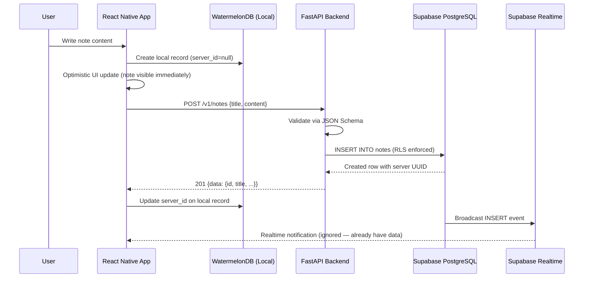
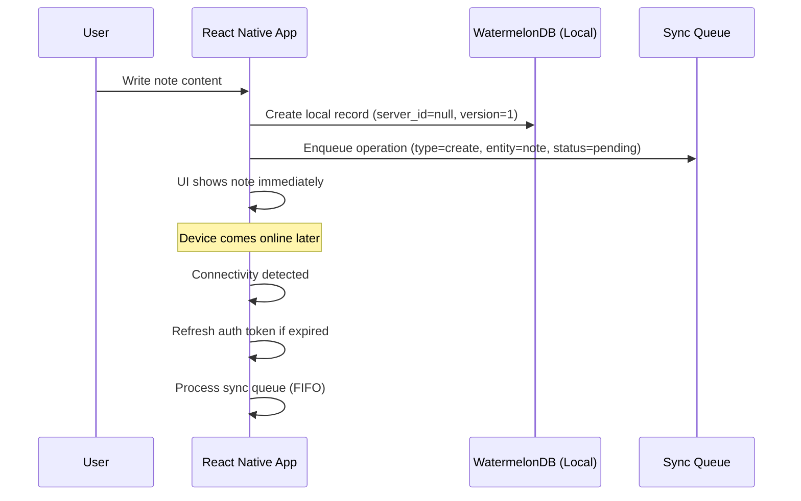
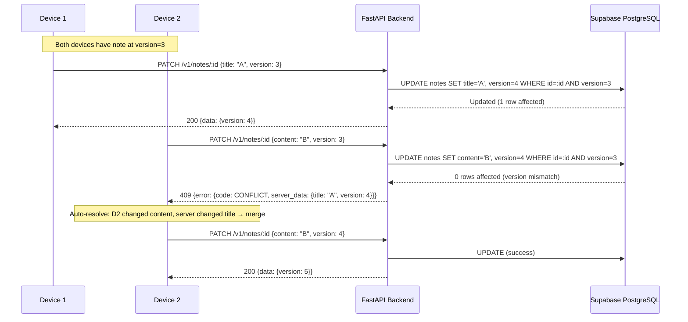
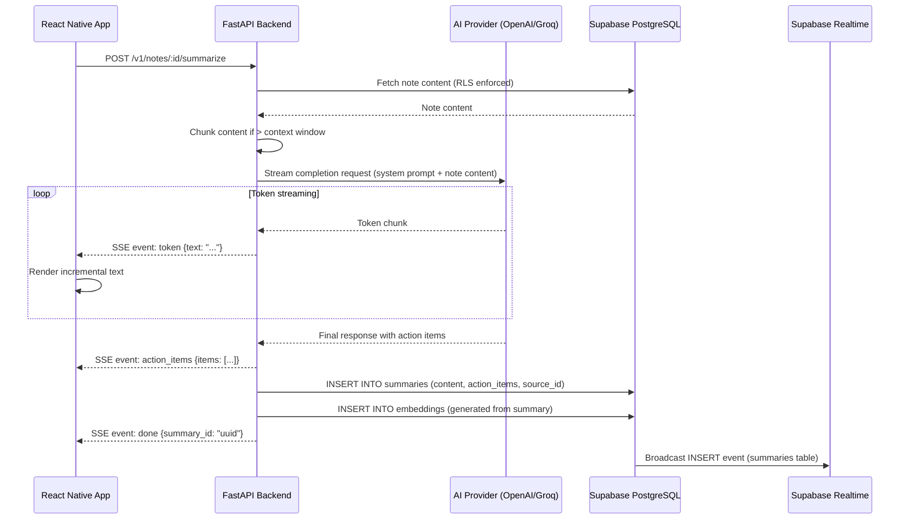
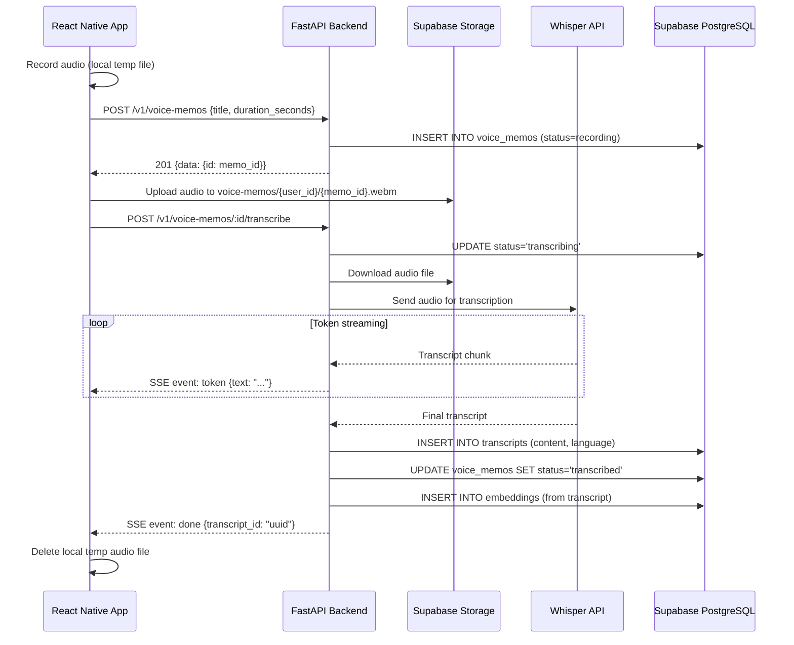
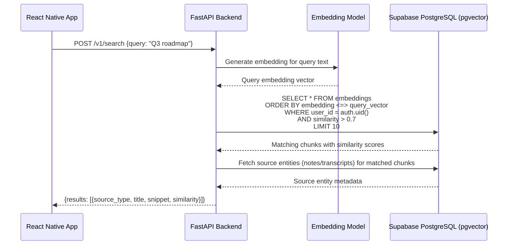
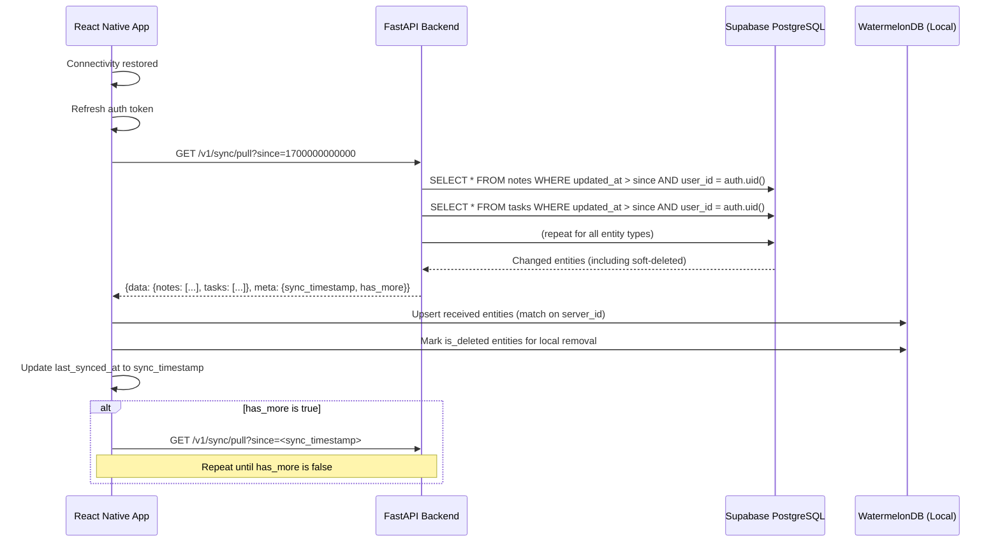
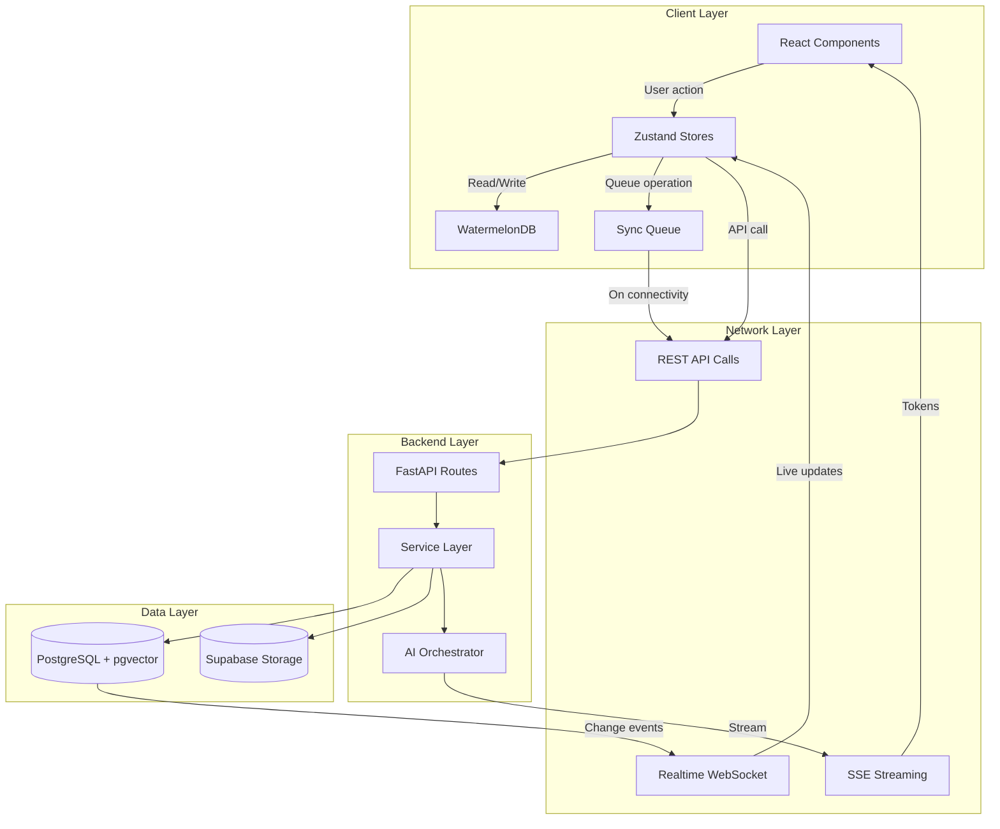

# Data Flow

## Overview

This document traces how data moves through Synapse for every major operation. It covers the online path, offline path, AI processing pipeline, and real-time update propagation. Each flow references the authoritative docs: [api-contract.md](api-contract.md), [offline-sync.md](offline-sync.md), [ai-integration.md](ai-integration.md).

## Flow 1: Create Note (Online)

**Key behaviors:**
- Local write happens BEFORE API call (optimistic)
- Realtime event arrives after API response — client deduplicates via `server_id`
- If API call fails, note persists locally and enters sync queue

## Flow 2: Create Note (Offline)

When connectivity resumes, the sync queue is processed via `POST /v1/sync/push`. See offline-sync.md for queue processing rules.

## Flow 3: Edit Note with Conflict

**Conflict resolution rules:**
1. Non-overlapping field changes → auto-merge (client retries with server version)
2. Same field changed → surface to user for manual resolution
3. Delete vs. edit → delete wins (consistent with offline-sync.md)

## Flow 4: AI Summarization

**Key behaviors:**
- Tokens stream to client as they arrive (low latency UX)
- Summary is persisted AFTER full generation (not incremental saves)
- Embedding is generated from the final summary text
- If provider fails mid-stream, `SSE event: error` is sent and no summary is persisted

## Flow 5: Voice Memo → Transcript

## Flow 6: Semantic Search

**Key behaviors:**
- Query text is embedded using same model as content embeddings (consistency)
- pgvector `<=>` operator for cosine distance
- RLS enforced — user only sees their own embeddings
- Results include snippet (matched chunk text), not full content

## Flow 7: Sync Pull (Hydrating After Offline)

## Data Flow Boundaries

## Invariants

1. **Local-first:** Every user action writes to WatermelonDB before making any API call
2. **No data loss:** Failed API calls are queued (sync queue), not dropped
3. **Consistency:** `version` field on every mutable entity enables optimistic concurrency
4. **Idempotency:** Sync push operations use `operation_id` to prevent duplicate processing
5. **Privacy:** User content never appears in logs, Sentry events, or error messages
6. **Single authority:** Server is the source of truth; local DB is a cache with write-ahead capability
