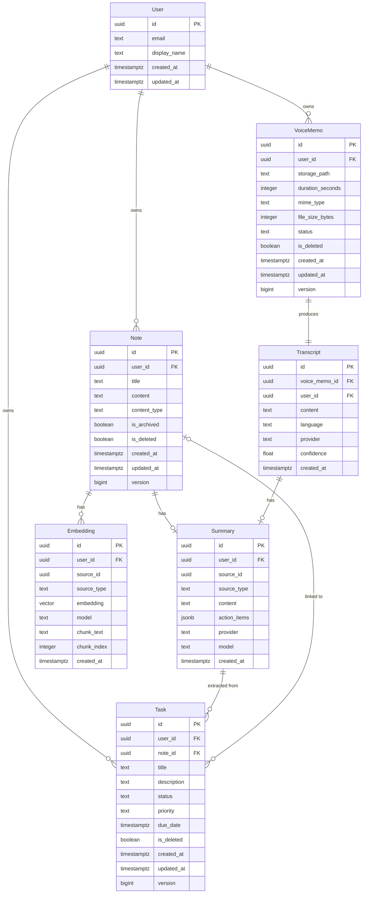

# Data Model

## Overview

Synapse's data model serves three concerns simultaneously:

1. **CRUD persistence** — standard relational data in PostgreSQL
2. **Offline sync** — every mutation must be trackable and replayable
3. **Semantic search** — text content must be embeddable as vectors

These concerns shape every entity design decision.

## Entity Relationship Diagram



## Core Entities

### User

Managed by Supabase Auth. Synapse stores no passwords — auth is fully delegated.

The `User` row in the public schema is created via a Supabase trigger on `auth.users` insert. This row exists to serve as a foreign key target for RLS policies.

### Note

Primary content entity. Text-based, supports archiving and soft deletion.

**Sync-critical fields:**
- `version` — monotonically incrementing integer, used for conflict detection
- `updated_at` — server-set timestamp, used for ordering
- `is_deleted` — soft delete flag; physical deletion happens via scheduled cleanup

**Content type** is `plain` or `markdown`. Rich text is out of scope for Phase 1.

### Task

Lightweight task entity. Can be standalone or linked to a Note (extracted action items link back to their source).

**Status enum:** `todo` | `in_progress` | `done` | `cancelled`
**Priority enum:** `low` | `medium` | `high` | `urgent`

Tasks extracted from AI summaries are created with `note_id` set to the source note. Standalone tasks have `note_id = null`.

### VoiceMemo

Metadata record for audio files stored in Supabase Storage.

**Status enum:** `recording` | `uploaded` | `transcribing` | `transcribed` | `failed`

The actual audio binary lives in Supabase Storage at `voice-memos/{user_id}/{memo_id}.{ext}`. The database row stores only the path.

**Offline implication:** Voice memo *metadata* (title, duration, status) is persisted locally and included in the sync queue. The *audio binary* is held in a temporary file cache and queued as a single file upload operation — it is NOT persisted in the local database or available for offline playback. Once uploaded to Supabase Storage, the local temporary file is deleted. The `status` field tracks processing state (`recording` → `uploaded` → `transcribing` → `transcribed`).

### Transcript

Produced from VoiceMemo via Whisper API. One-to-one relationship.

**Immutable after creation** — transcripts are never edited, only regenerated. This simplifies sync (no conflict possible).

### Summary

AI-generated summary of a Note or Transcript. Polymorphic source via `source_id` + `source_type`.

`action_items` is a JSONB array of extracted tasks:
```json
[
  { "text": "Schedule follow-up meeting", "priority": "high" },
  { "text": "Update project timeline", "priority": "medium" }
]
```

**Immutable after creation** — regenerating creates a new Summary row, old one is preserved for audit.

### Embedding

Vector representation of text content for semantic search. Uses pgvector.

One source (Note or Transcript) may produce multiple embeddings if the content is chunked. `chunk_index` tracks ordering.

**Model tracking:** The `model` field records which embedding model produced the vector (e.g., `text-embedding-3-small`). This is critical because changing models requires re-embedding all content.

**Dimension:** 1536 (OpenAI text-embedding-3-small) or 384 (all-MiniLM-L6-v2 for local/free alternative). Decided at deployment time via config.

## Sync Entities

These entities exist only locally and in the sync layer — they are not persisted to Supabase.

### SyncOperation

```typescript
interface SyncOperation {
  id: string;                          // UUID
  entity_type: 'note' | 'task' | 'voice_memo';
  entity_id: string;                   // UUID of the entity
  operation: 'create' | 'update' | 'delete';
  payload: Record<string, unknown>;    // Changed fields only (for update)
  created_at: number;                  // Timestamp (ms)
  retry_count: number;
  status: 'pending' | 'in_flight' | 'failed' | 'resolved';
  error?: string;
}
```

Stored in WatermelonDB-backed local persistence alongside entity tables. Processed FIFO when connectivity is available.

### ConflictRecord

```typescript
interface ConflictRecord {
  id: string;
  sync_operation_id: string;
  entity_type: string;
  entity_id: string;
  local_version: number;
  server_version: number;
  local_data: Record<string, unknown>;
  server_data: Record<string, unknown>;
  resolution: 'pending' | 'local_wins' | 'server_wins' | 'merged';
  resolved_at?: number;
}
```

Created when a sync operation encounters a version mismatch. Most conflicts auto-resolve via last-write-wins on `updated_at`. Complex conflicts (both sides edited same field) surface to the user.

## Ownership Model

Every data entity has a `user_id` foreign key. Supabase RLS policies enforce:

- Users can only SELECT/INSERT/UPDATE/DELETE their own rows
- RLS is enforced at the database level — the API cannot bypass it
- No shared/collaborative entities in Phase 1 (single-user only)

## Versioning Strategy

Mutable entities (`Note`, `Task`, `VoiceMemo`) use optimistic versioning:

1. Client reads entity with `version: N`
2. Client sends update with `expected_version: N`
3. Server checks `WHERE id = $id AND version = $expected_version`
4. If match → update succeeds, `version` becomes `N + 1`
5. If no match → 409 Conflict, client must fetch latest and reconcile

This prevents lost updates without requiring pessimistic locking.

## Soft Deletion

All mutable entities use `is_deleted` flag instead of physical deletion.

Reasons:
- Offline clients may reference deleted entities
- Sync queue may contain operations targeting deleted entities
- Audit trail preservation
- Physical cleanup runs as a scheduled Supabase Edge Function (delete where `is_deleted = true AND updated_at < now() - interval '30 days'`)

## Vector Search Implications

Embeddings are stored using pgvector's `vector` type with an IVFFlat index (for free-tier performance).

Search query flow:
1. User enters search text
2. Backend generates embedding from query text
3. PostgreSQL performs `<=>` (cosine distance) query against `embedding` table
4. Results are filtered by `user_id` (RLS) and joined to source entities
5. Ranked results returned with similarity scores

**Index consideration:** IVFFlat requires `CREATE INDEX` with `lists` parameter tuned to data size. With <10K embeddings per user, a single list is sufficient. Re-index is needed at scale.
