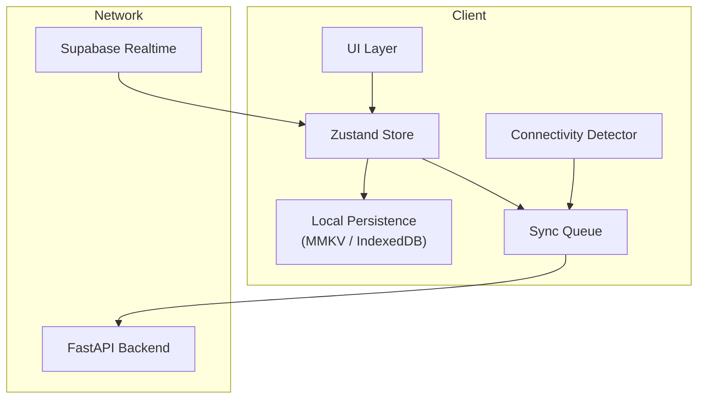
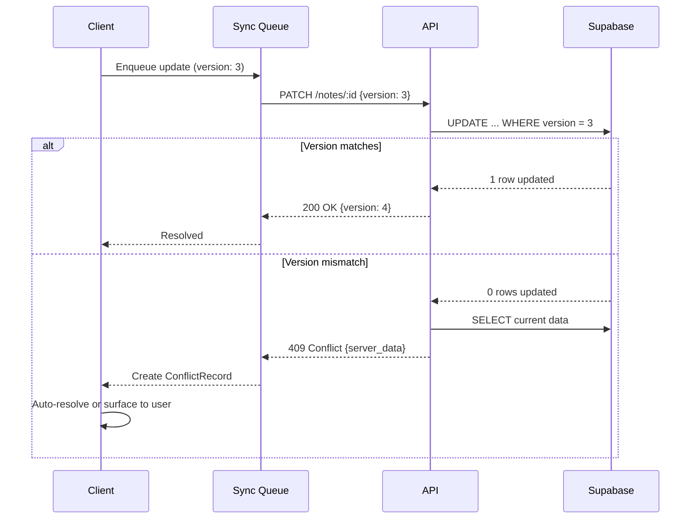

# Offline-First Sync Architecture

## Core Principle

Every user action succeeds immediately on the local device. Network availability determines when — not whether — data reaches the server.

The app must feel identical whether the user is online, offline, or transitioning between states. No spinners for writes. No "you are offline" modals blocking interaction.

## Architecture Layers



## Write Path (Optimistic Updates)

Every mutation follows this exact sequence:

```
1. User taps "Save"
2. Store updates immediately (optimistic)
3. Local persistence writes updated entity
4. SyncOperation created and enqueued
5. UI reflects change instantly

--- If online ---
6. Queue processor sends to API
7. API validates and writes to Supabase
8. Success → SyncOperation marked "resolved"
9. Realtime broadcasts change to other devices

--- If offline ---
6. Queue waits for connectivity
7. Steps 6-9 execute when connection resumes
```

### Why version the entity, not the operation?

Each mutable entity carries a `version` field. On update, the client sends `version: N` (the version it last read). The server checks this. If the server's version is also N, update succeeds and version becomes N+1. If server is at version M > N, it's a conflict.

This is simpler than operation-based CRDTs and sufficient for a single-user system where conflicts are rare.

## Sync Queue

```typescript
interface SyncQueue {
  operations: SyncOperation[];

  enqueue(op: SyncOperation): void;
  peek(): SyncOperation | null;       // Oldest pending
  markInFlight(id: string): void;
  markResolved(id: string): void;
  markFailed(id: string, error: string): void;
  getRetryable(): SyncOperation[];    // Failed with retry_count < MAX
  clear(): void;
}
```

### Processing Rules

1. **FIFO order** — operations for the same entity must execute in creation order
2. **Entity-level serialization** — never send two operations for the same entity concurrently
3. **Cross-entity parallelism** — operations for different entities can execute in parallel (up to 3 concurrent)
4. **Idempotency** — each operation has a UUID; the server deduplicates
5. **Batch support** — when many operations queue up (e.g., coming back online after hours), send via `/v1/sync/push` batch endpoint

### Retry Strategy

```
Attempt 1: immediate
Attempt 2: 1 second delay
Attempt 3: 5 seconds
Attempt 4: 30 seconds
Attempt 5: 5 minutes
After 5 failures: mark as "failed", surface to user
```

Retries only trigger for network errors and 5xx responses. 4xx errors (validation, conflict) are never retried — they require resolution.

## Conflict Detection

A conflict occurs when:
1. Client sends update with `version: N`
2. Server has `version: M` where `M > N`

This means another device (or the server itself) modified the entity after this client's last read.

### Resolution Strategy

**Default: Last-write-wins on `updated_at`**

For most fields, the most recent write wins. This handles 95% of real conflicts for a single-user app (multiple devices editing different things at different times).

**Field-level merge for Notes:**

If both sides edited a Note's content:
1. Compare which fields actually changed on each side
2. If different fields changed → merge (take each side's changed fields)
3. If same field changed → latest `updated_at` wins, save losing version to ConflictRecord

**User-visible conflicts:**

When auto-resolution isn't possible (same field, close timestamps), the conflict surfaces in the UI:
- ConflictRecord stored locally
- UI shows "This note was edited on another device" with diff view
- User chooses which version to keep or manually merges

### Conflict Flow



## Pull Sync (Hydration)

When a client comes online or opens the app, it needs to catch up:

```
GET /v1/sync/pull?since=1700000000000
```

Returns all entities modified after the given timestamp. The client:

1. Stores the pull timestamp in local persistence
2. Merges server data into local store
3. For each entity, compares with pending queue operations
4. If a pending operation targets the same entity with a lower version, the operation's version is updated to match server state
5. Updates UI

**Initial sync (first launch):** `since=0` fetches everything. For a typical user this is <1000 entities — a single request.

**Delta sync:** On subsequent opens, only changes since last pull are fetched. Most syncs return <50 entities.

## Realtime Subscription

While online, the client subscribes to Supabase Realtime for live updates:

```typescript
supabase
  .channel('user-changes')
  .on('postgres_changes', {
    event: '*',
    schema: 'public',
    filter: `user_id=eq.${userId}`
  }, (payload) => {
    store.handleRealtimeChange(payload);
  })
  .subscribe();
```

Realtime handles the "other device edited something while I'm looking at it" case without polling.

**Deduplication:** When a client sends an update and receives its own change back via Realtime, it ignores the echo (matched by entity ID + version).

## Local Persistence

| Platform | Technology | Purpose |
|----------|-----------|---------|
| Mobile | MMKV (react-native-mmkv) | Fast key-value store for entities + sync queue |
| Web | IndexedDB (via idb) | Structured storage with good capacity |

Both stores use the same abstract `LocalStore` interface from `@synapse/shared`:

```typescript
interface LocalStore {
  getEntity<T>(type: string, id: string): Promise<T | null>;
  setEntity<T>(type: string, id: string, data: T): Promise<void>;
  getAllEntities<T>(type: string): Promise<T[]>;
  deleteEntity(type: string, id: string): Promise<void>;
  getLastSyncTimestamp(): Promise<number>;
  setLastSyncTimestamp(ts: number): Promise<void>;
}
```

Platform-specific implementations live in `apps/mobile/services/`. The interface lives in `@synapse/shared`.

## Connectivity Detection

```typescript
interface ConnectivityState {
  isConnected: boolean;         // Network available
  isReachable: boolean;         // API responds to health check
  lastCheckedAt: number;
}
```

- **Mobile:** `@react-native-community/netinfo` for network state
- **Web:** `navigator.onLine` + periodic health check ping
- **Debounce:** Connectivity changes are debounced by 2 seconds to avoid flapping

When transitioning from offline → online:
1. Pull sync (fetch changes missed while offline)
2. Process sync queue (push local changes)
3. Resume Realtime subscription

## Edge Cases

| Scenario | Behavior |
|----------|----------|
| Edit while offline, same note edited on another device | Conflict detection on push, auto-resolve or surface |
| Delete while offline, entity edited on server | Delete wins (soft delete flag takes precedence) |
| Create while offline, come online | POST with client-generated UUID, server stores as-is |
| Large offline session (100+ operations) | Batch push via `/v1/sync/push`, processed server-side |
| Token expires while offline | Re-auth on connectivity resume before queue processing |
| App killed while sync in flight | On restart, check queue for `in_flight` operations, reset to `pending` |

## Assumptions

1. Single-user per account — no collaborative editing in Phase 1
2. Conflicts are rare (< 1% of operations) since most users use one device at a time
3. Local storage never exceeds device limits (bounded by content types — text-only, no large files locally)
4. Voice memo audio binaries are NOT persisted in local storage — they're held in a temporary file cache and uploaded to Supabase Storage as soon as connectivity is available. Voice memo *metadata* (title, duration, status) IS stored locally and synced via the normal sync queue. Once the upload completes, the temporary audio file is deleted from the device
