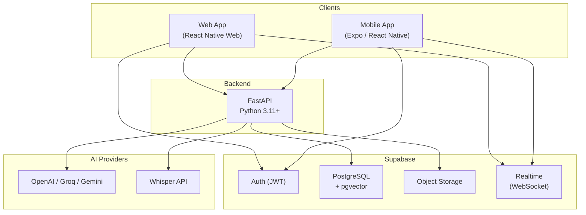
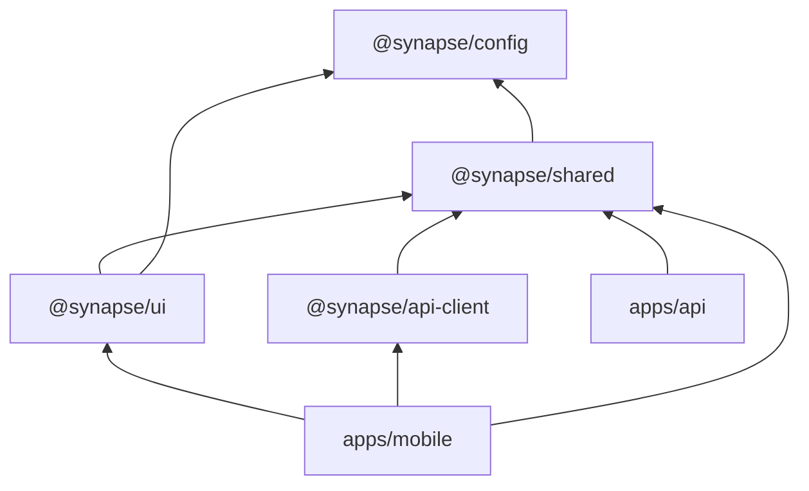

# Architecture Overview

## System Context

Synapse is a three-tier system: cross-platform frontend, Python API backend, and Supabase as the persistence/auth/realtime layer. AI capabilities are delegated to external providers via a backend abstraction layer.



## Responsibilities

### Frontend (Expo + React Native Web)

- Render UI across web, iOS, Android from single codebase
- Handle authentication flow via Supabase Auth
- Maintain local persistence for offline capability
- Execute optimistic updates and queue sync operations
- Subscribe to Supabase Realtime for live data changes
- Stream AI responses to UI via SSE from API

The frontend does NOT:
- Call AI providers directly (all AI goes through backend)
- Execute complex business logic (shared package handles this)
- Manage database migrations or schema

### Backend (FastAPI)

- Orchestrate AI operations (summarization, transcription, embedding)
- Validate and transform data before persistence
- Stream AI responses to clients via Server-Sent Events
- Generate and store embeddings for semantic search
- Handle file processing (voice memos → transcripts)
- Enforce business rules that require server-side authority

The backend does NOT:
- Manage auth directly (Supabase Auth handles this)
- Serve static frontend assets (Vercel handles this)
- Perform realtime push to clients (Supabase Realtime handles this)

### Supabase

- PostgreSQL as primary data store
- pgvector for embedding storage and similarity search
- Auth with JWT and Row Level Security
- Object storage for voice memos and attachments
- Realtime subscriptions for live data sync
- Edge Functions for lightweight server-side hooks (if needed)

### AI Providers

- LLM APIs for summarization, action item extraction, Q&A
- Whisper for voice-to-text transcription
- Embedding models for semantic vector generation

All AI calls are proxied through the backend — clients never call AI providers directly. This enables:
- API key isolation
- Usage tracking
- Provider switching without client updates
- Response caching

## Data Flow Patterns

### 1. Online Write (Happy Path)

```
Client → Optimistic UI update → API request → Supabase write → Realtime broadcast → Other clients update
```

### 2. Offline Write

```
Client → Optimistic UI update → Local persistence → Sync queue
                                                      ↓ (when online)
                                                   API request → Supabase write → Realtime broadcast
```

### 3. AI Summarization

```
Client → POST /api/notes/{id}/summarize
  → API fetches note content from Supabase
  → API streams LLM response via SSE
  → Client renders streaming tokens
  → API stores final summary in Supabase
  → Realtime broadcasts summary to other clients
```

### 4. Voice Memo Flow

```
Mobile → Record audio → Upload to Supabase Storage
  → POST /api/voice-memos/{id}/transcribe
  → API downloads audio from Storage
  → API calls Whisper API
  → API stores transcript in Supabase
  → API triggers summarization (optional)
  → Realtime broadcasts transcript to other clients
```

## Package Dependency Graph



`@synapse/shared` is the critical package — it contains types, validation schemas, and business logic used by both frontend and backend. The backend consumes it via a thin TypeScript-to-Python bridge (generated types + shared validation schemas exported as JSON Schema).

## Key Architecture Decisions

| Decision | Rationale | ADR |
|----------|-----------|-----|
| Turborepo + pnpm monorepo | Fast builds, native workspace support | [ADR-001](../adr/001-monorepo-turborepo-pnpm.md) |
| Expo + React Native Web | Single codebase for web + mobile | [ADR-002](../adr/002-expo-react-native-web.md) |
| Supabase as BaaS | Auth + DB + Storage + Realtime in one service | [ADR-003](../adr/003-supabase-baas.md) |
| FastAPI backend | AI orchestration needs Python ecosystem | [ADR-004](../adr/004-fastapi-backend.md) |
| Offline-first sync | Portfolio differentiator, real-world requirement | [ADR-005](../adr/005-offline-first-sync.md) |
| SSE for AI streaming | Simpler than WebSocket for unidirectional streams | [ADR-006](../adr/006-ai-streaming.md) |

## Constraints

1. **No local LLMs** — all AI via cloud APIs due to resource constraints
2. **No Android Studio** — web development and Expo Go for mobile testing
3. **Ubuntu/VMware** — lightweight tooling, fast feedback loops
4. **Supabase free tier initially** — design for tier limits (500MB DB, 1GB storage)
5. **Single developer** — architecture must minimize operational overhead
