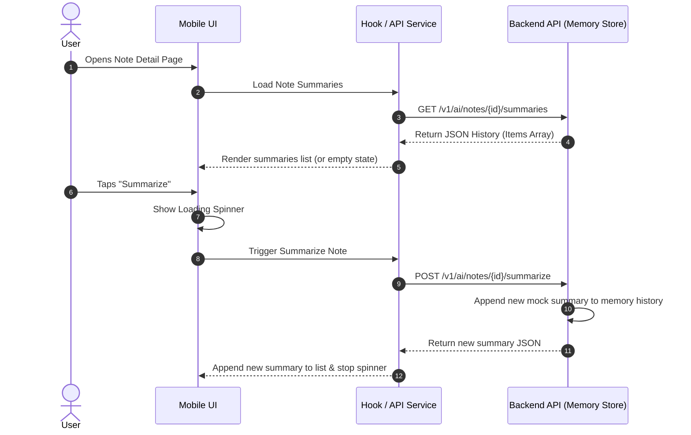
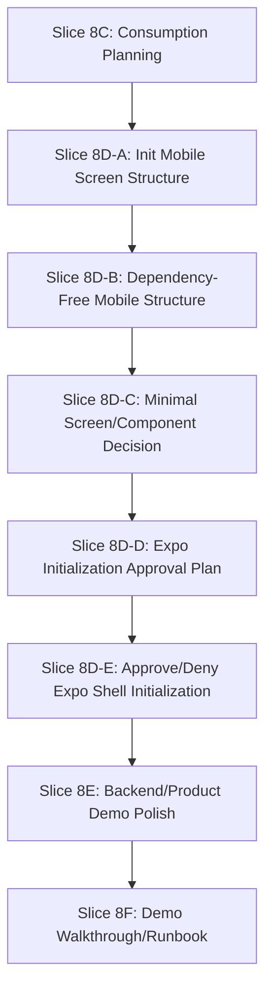

# Summary History UI/API Consumption Plan

## 1. Objective

This document outlines the plan for the frontend and mobile layers to consume the fake summary history API for local demonstration purposes. It establishes UI/API boundary lines, defines user flow expectations, evaluates candidate implementation paths, and ensures that early frontend work integrates with the backend mock summary services without introducing real AI provider wiring, Supabase dependencies, or persistent state.

---

## 2. Non-Goals

This plan explicitly excludes:

*   **Real OpenAI / LLM provider implementation**: No runtime connection to external AI services is planned.
*   **SDK installation**: No vendor AI SDKs (such as OpenAI SDK) will be added to the mobile app.
*   **Credentials & Secrets**: No API keys, token configurations, or environment variables (`.env`) for LLM providers.
*   **Durable persistence**: No Supabase PostgreSQL storage, SQL schemas, migrations, or local SQLite persistence for summaries. Summaries remain memory-only in this demo context.
*   **Server-Sent Events (SSE) / streaming**: Re-evaluating streaming is deferred; this plan focuses solely on standard JSON success/error envelopes.
*   **Production-ready quality**: Output remains deterministic, canned mockup summaries produced by the fake backend provider.

---

## 3. Current Backend/Client Baseline

The project baseline contains the following completed structures:

*   **`POST /v1/ai/notes/{note_id}/summarize`**: Backend endpoint that generates a fake-provider summary and appends it to an in-memory history map keyed by user and note.
*   **`GET /v1/ai/notes/{note_id}/summaries`**: Backend endpoint that lists all in-memory summaries recorded for the authenticated user's note, newest first for note-detail consumption.
*   **`client.ai.listNoteSummaries(note_id)`**: A fully typed API client integration in `packages/api-client` to fetch summary history.
*   **`client.ai.summarizeNote(note_id)`**: An API client integration to request a new note summary.
*   **Dependency-free mobile API/view-state boundary**: `apps/mobile` can list summaries, request fake summary generation, model summarizing state, append generated summaries, dedupe by summary id, and preserve newest-first display order without rendering Expo or React Native UI.
*   **Shared Contract `ListSummariesResponse`**: Reusable Zod-validated TypeScript contracts in `packages/shared`.
*   **Memory-Only State**: The backend service uses a process-local memory store that resets when the API server restarts.

---

## 4. UI Demo Goal

The goal is to demonstrate a cohesive user flow in the frontend that visualizes summarization actions and history without durable storage.

### Minimal Demo Flow
1.  **Open Note Detail**: The user navigates to a specific note. The screen triggers a fetch of past summaries for that note.
2.  **View History**: If summaries exist, they are displayed chronologically (newest first). If none exist, a friendly "No summaries generated yet" empty state is shown.
3.  **Trigger Summarization**: The user taps a "Summarize Note" button.
4.  **Loading State**: The button disables and a loading spinner appears.
5.  **Append to List**: Once the API client call completes, the newly returned summary is appended to the UI list and displayed newest first.
6.  **Repeated summaries**: Tapping the button again appends another mock summary to the history.
7.  **Reset Limitation**: A notice explains that summary history is **memory-only** and will clear if the backend server restarts.

---

## 5. Candidate Implementation Options

We evaluate three candidate approaches for introducing this consumption path:

### Option A: Minimal screen/component in `apps/mobile` for note summary history
*   **Description**: Add a simple React Native/Expo component or sub-screen under note details that utilizes the existing `api-client` methods to display the summary history list and trigger a new summary.
*   **Value**: High. Shows end-to-end integration and provides direct visual validation for portfolio demonstration.
*   **Effort**: Medium-High. Requires initializing a minimal mobile screen structure since `apps/mobile` is currently an uninitialized placeholder.
*   **Risk**: Medium. Expo setup could introduce configuration issues or typecheck noise if not handled incrementally.
*   **CV/Demo Value**: High. Illustrates mobile-to-backend integration.
*   **Recommended Agent**: Frontend / Mobile developer agent.
*   **Next Slice**: Slice 8D (split into 8D-A and 8D-B).

### Option B: API client only + Story/demo mock screen later
*   **Description**: Create a standalone Storybook component or isolated web-component sandbox inside the workspace to display the summary history data flow, leaving mobile initialization for later.
*   **Value**: Medium. Validates UI state transitions but does not lay down the actual mobile app foundation.
*   **Effort**: Medium.
*   **Risk**: Low.
*   **CV/Demo Value**: Medium.
*   **Recommended Agent**: Frontend developer agent.
*   **Next Slice**: Slice 8D (Storybook mock screen setup).

### Option C: Backend-only for now, switch to Notes CRUD/product work
*   **Description**: Defer all frontend integration for summarization. Immediately switch to completing durable PostgreSQL/Supabase persistence for the core Notes CRUD features.
*   **Value**: Low for the AI summary demo, but high for core app stability.
*   **Effort**: High.
*   **Risk**: High. Requires reopening Supabase RLS and migration debates.
*   **CV/Demo Value**: Low. No new user-facing features or flows are visualized.
*   **Recommended Agent**: Database / Backend developer agent.
*   **Next Slice**: Slice 9A (Supabase persistence planning).

---

## 6. Recommended Option

> [!TIP]
> **We recommend Option A.** Keeping the implementation fake-provider-only and memory-only provides high demo value while avoiding database complexity.

### Implementation Risk & Precondition mitigation
Because `apps/mobile` is currently uninitialized, proceeding directly with full screen implementation carries bootstrap risks. Slice 8D is split into small approval-safe steps:
*   **Slice 8D-A (Inspect mobile structure)**: Confirmed that `apps/mobile` is still a placeholder with no `src`, router, rendered UI, API access layer, hook layer, or mobile test setup.
*   **Slice 8D-B (Dependency-free mobile structure)**: Add plain TypeScript source structure, an app-level API boundary, summary-history API adapter, deterministic view-state mapping, and a non-rendering placeholder module without package manifest or dependency changes.
*   **Slice 8D-C (Minimal screen/component decision)**: Create the Expo/React Native initialization approval plan (`docs/mobile-expo-initialization-approval-plan.md`) due to missing runtime packages.
*   **Slice 8D-D (Initialization Approval Plan)**: Present the detailed initialization plan and obtain feedback on the smallest safe runtime footprint *(Complete)*.
*   **Slice 8D-E (Approve/Deny Expo Shell Initialization)**: Recorded approval decision. Expo/React Native initialization is **DEFERRED** due to missing dependency/lockfile/CI/VM resource approvals.

---

## 7. UI/API Boundaries

To preserve clean separation of concerns:

*   **Hook/Service Layer Abstraction**: UI screen components must not invoke raw `fetch` requests or call `@synapse/api-client` directly. They should consume summaries via an app-level API access layer or hooks (e.g., `useNoteSummaries(noteId)`).
*   **Provider details**: The UI must remain vendor-agnostic. It must not contain hardcoded assumptions about "OpenAI" or "Gemini". It should render information based on the generic fields (`provider`, `model`, `content`, `action_items`) returned by the API client.
*   **No raw diagnostics**: Diagnostic payloads (like raw LLM responses or token metrics) must not be rendered in the user-facing UI.
*   **Memory-Only UX Requirements**:
    *   **Empty State**: Explicitly handles notes with zero summaries, displaying a prompt to generate the first one.
    *   **Loading State**: Visual spinner or skeleton screens showing that a summary request is in progress, disabling the trigger button.
    *   **Error State**: Gracefully shows network or validation errors returned from the API client (e.g., note not found, network failure) without exposing raw stack traces.
    *   **Demo Note / Reset Notice**: A UI label reminding the user that "Summaries are stored in transient server memory and will be cleared when the dev backend restarts."

---

## 8. Security/Privacy Constraints

All security and privacy policies defined in `docs/security/privacy-and-data-handling.md` must be enforced:

*   **No Credentials in UI**: No API keys, bearer tokens (other than the user's validated auth JWT), or service-role keys may be stored or referenced in the mobile project.
*   **No Prompt Leakage**: Raw system prompts or prompt structures must never be exposed or logged client-side.
*   **No Secret Fixtures**: Mock data used for testing must not contain real keys or PII.
*   **No Supabase/RLS Assumptions**: The UI must not assume a live database connection or try to bypass the backend router to query summaries directly.

---

## 9. Slice 8D-B Result

Slice 8D-B adds a dependency-free mobile source structure for future summary history UI consumption:

*   **`apps/mobile/tsconfig.json`** enables direct TypeScript verification for plain mobile source files.
*   **`apps/mobile/src/api/synapseClient.ts`** centralizes API client construction at the app boundary.
*   **`apps/mobile/src/features/notes/summaryHistoryApi.ts`** wraps `client.ai.listNoteSummaries(note_id)` behind an injected feature API dependency and re-validates the shared summary history data shape.
*   **`apps/mobile/src/features/notes/summaryHistoryViewState.ts`** maps API data and errors into UI-safe `idle`, `loading`, `empty`, `success`, and `error` states.
*   **`apps/mobile/src/features/notes/noteSummaryHistoryPlaceholder.ts`** documents the future screen regions without rendering React, React Native, or Expo UI.

This slice intentionally does not add dependencies, edit package manifests, edit lockfiles, initialize Expo, render a React Native screen, store secrets, introduce provider-specific UI data, add prompt/raw note logging, or change backend/runtime provider behavior.

---

## 10. Test Strategy for Future Implementation

*   **API Client**: Already fully covered by unit tests in `packages/api-client/src/ai.test.ts`.
*   **UI Components**: Implement lightweight state/component tests using `react-test-renderer` or `@testing-library/react-native` only if the mobile package testing infrastructure is initialized.
*   **Dependency Hygiene**: Do not introduce any new test dependencies or testing packages in this slice.
*   **Type Safety**: Ensure TypeScript compilation (`tsc`) and workspace builds remain green.

---

## 11. Future Slices Roadmap

We propose the following roadmap for upcoming iterations:

*   **Slice 8D-A** — Inspect/init minimal mobile screen structure.
*   **Slice 8D-B** — Add dependency-free mobile API/view-state structure for summary history consumption.
*   **Slice 8D-C** — Minimal screen/component decision.
*   **Slice 8D-D** — Expo/React Native Initialization Approval Plan.
*   **Slice 8D-E** — Approve or deny minimal Expo app shell initialization *(Complete — decision DEFERRED)*.
*   **Slice 8E** — Backend/product demo polish using existing fake-provider flow *(Complete — backend and dependency-free view-state polish added)*.
*   **Slice 8F** — Dependency-free demo walkthrough/runbook for the fake-provider note detail flow *(Complete — API-level runbook recorded)*.
*   **Slice 8G** — Rendered mobile demo unblock decision packet *(Complete — decision DEFERRED, 10/12 gates missing, recommended Option B)*.
*   **Slice 8H** — Note CRUD / summary demo API walkthrough hardening *(recommended next action)*.

---

## 12. Slice 8E Result

Slice 8E adds backend/product demo polish while preserving the deferred Expo decision:

*   **Backend ordering**: `GET /v1/ai/notes/{note_id}/summaries` now returns memory-only fake summaries newest first.
*   **Demo-flow verification**: Backend tests cover note detail fetch, empty summary history, repeated fake summary generation, newest-first summary listing, and AI surface/log redaction.
*   **Dependency-free mobile generation boundary**: `apps/mobile/src/features/notes/summaryHistoryApi.ts` now exposes `summarizeForNote(noteId)` through the injected API adapter.
*   **Dependency-free mobile view state**: `apps/mobile/src/features/notes/summaryHistoryViewState.ts` now models `summarizing`, append/dedupe behavior, newest-first sorting, and safe error mapping for generated summaries.
*   **Record**: See [Backend Product Demo Polish Record](backend-product-demo-polish-record.md).

No package manifests, lockfiles, dependency installs, Expo runtime files, rendered mobile UI, live provider work, credentials, `.env`, SQL, migrations, Supabase state, Docker work, or generated state were added.

---

## 13. Historical Definition of Done (Slice 8D-D)

Slice 8D-D was complete when:
1.  `docs/mobile-expo-initialization-approval-plan.md` is created and committed to `main`.
2.  `docs/summary-history-ui-consumption-plan.md` is updated to link to this plan.
3.  `docs/ai-summarization-implementation-plan.md` is updated to reflect Slice 8D-D planning status.
4.  `docs/security/privacy-and-data-handling.md` is updated to address environment config constraints.
5.  `docs/next-action.md` is updated to recommend Slice 8D-E.
6.  All fast checks pass cleanly without error.

---

## 14. Definition of Done (Slice 8E)

Slice 8E is complete when:
1.  Backend summary history lists fake summaries newest first.
2.  Backend tests cover the note detail demo sequence and AI surface/log redaction.
3.  The dependency-free mobile API boundary supports both listing and generating fake summaries.
4.  The dependency-free mobile view-state layer models summarizing, append, dedupe, newest-first ordering, and safe error states.
5.  No dependency, lockfile, rendered UI, live provider, credential, `.env`, SQL, migration, Supabase state, Docker, or generated state is added.
6.  Targeted backend and TypeScript checks pass.
