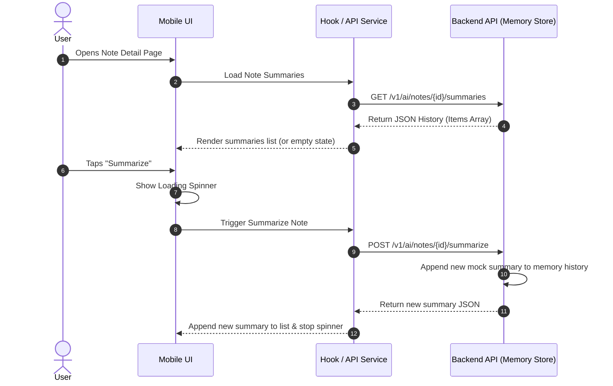
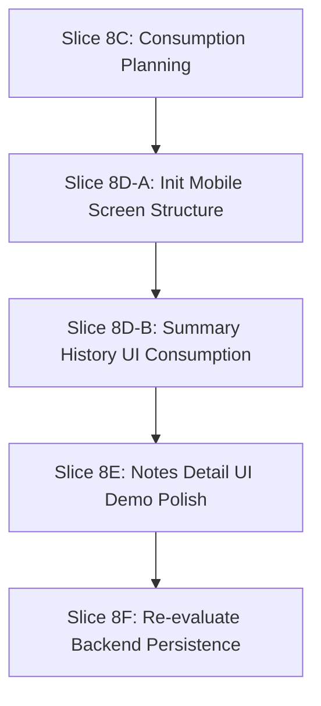

# Summary History UI/API Consumption Plan

## 1. Objective

This document outlines the plan for the frontend and mobile layers to consume the fake summary history API for local demonstration purposes. It establishes UI/API boundary lines, defines user flow expectations, evaluates candidate implementation paths, and ensures that early frontend work integrates with the backend mock summary services without introducing real AI provider wiring, Supabase dependencies, or persistent state.

---

## 2. Non-Goals

This plan explicitly excludes:

*   **Real OpenAI / LLM provider implementation**: No runtime connection to external AI services is planned.
*   **SDK installation**: No vendor AI SDKs (such as OpenAI SDK) will be added to the mobile app.
*   **Credentials & Secrets**: No API keys, token configurations, or environment variables (`.env`) for LLM providers.
*   **Durable persistence**: No Supabase PostgreSQL storage, SQL schemas, migrations, or local SQLite persistence for summaries. Summaries remain memory-only in this demo context.
*   **Server-Sent Events (SSE) / streaming**: Re-evaluating streaming is deferred; this plan focuses solely on standard JSON success/error envelopes.
*   **Production-ready quality**: Output remains deterministic, canned mockup summaries produced by the fake backend provider.

---

## 3. Current Backend/Client Baseline

The project baseline contains the following completed structures:

*   **`POST /v1/ai/notes/{note_id}/summarize`**: Backend endpoint that generates a fake-provider summary and appends it to an in-memory history map keyed by user and note.
*   **`GET /v1/ai/notes/{note_id}/summaries`**: Backend endpoint that lists all in-memory summaries recorded for the authenticated user's note.
*   **`client.ai.listNoteSummaries(note_id)`**: A fully typed API client integration in `packages/api-client` to fetch summary history.
*   **`client.ai.summarizeNote(note_id)`**: An API client integration to request a new note summary.
*   **Shared Contract `ListSummariesResponse`**: Reusable Zod-validated TypeScript contracts in `packages/shared`.
*   **Memory-Only State**: The backend service uses a process-local memory store that resets when the API server restarts.

---

## 4. UI Demo Goal

The goal is to demonstrate a cohesive user flow in the frontend that visualizes summarization actions and history without durable storage.

### Minimal Demo Flow
1.  **Open Note Detail**: The user navigates to a specific note. The screen triggers a fetch of past summaries for that note.
2.  **View History**: If summaries exist, they are displayed chronologically (newest first). If none exist, a friendly "No summaries generated yet" empty state is shown.
3.  **Trigger Summarization**: The user taps a "Summarize Note" button.
4.  **Loading State**: The button disables and a loading spinner appears.
5.  **Append to List**: Once the API client call completes, the newly returned summary is appended to the UI list.
6.  **Repeated summaries**: Tapping the button again appends another mock summary to the history.
7.  **Reset Limitation**: A notice explains that summary history is **memory-only** and will clear if the backend server restarts.

---

## 5. Candidate Implementation Options

We evaluate three candidate approaches for introducing this consumption path:

### Option A: Minimal screen/component in `apps/mobile` for note summary history
*   **Description**: Add a simple React Native/Expo component or sub-screen under note details that utilizes the existing `api-client` methods to display the summary history list and trigger a new summary.
*   **Value**: High. Shows end-to-end integration and provides direct visual validation for portfolio demonstration.
*   **Effort**: Medium-High. Requires initializing a minimal mobile screen structure since `apps/mobile` is currently an uninitialized placeholder.
*   **Risk**: Medium. Expo setup could introduce configuration issues or typecheck noise if not handled incrementally.
*   **CV/Demo Value**: High. Illustrates mobile-to-backend integration.
*   **Recommended Agent**: Frontend / Mobile developer agent.
*   **Next Slice**: Slice 8D (split into 8D-A and 8D-B).

### Option B: API client only + Story/demo mock screen later
*   **Description**: Create a standalone Storybook component or isolated web-component sandbox inside the workspace to display the summary history data flow, leaving mobile initialization for later.
*   **Value**: Medium. Validates UI state transitions but does not lay down the actual mobile app foundation.
*   **Effort**: Medium.
*   **Risk**: Low.
*   **CV/Demo Value**: Medium.
*   **Recommended Agent**: Frontend developer agent.
*   **Next Slice**: Slice 8D (Storybook mock screen setup).

### Option C: Backend-only for now, switch to Notes CRUD/product work
*   **Description**: Defer all frontend integration for summarization. Immediately switch to completing durable PostgreSQL/Supabase persistence for the core Notes CRUD features.
*   **Value**: Low for the AI summary demo, but high for core app stability.
*   **Effort**: High.
*   **Risk**: High. Requires reopening Supabase RLS and migration debates.
*   **CV/Demo Value**: Low. No new user-facing features or flows are visualized.
*   **Recommended Agent**: Database / Backend developer agent.
*   **Next Slice**: Slice 9A (Supabase persistence planning).

---

## 6. Recommended Option

> [!TIP]
> **We recommend Option A.** Keeping the implementation fake-provider-only and memory-only provides high demo value while avoiding database complexity.

### Implementation Risk & Precondition mitigation
Because `apps/mobile` is currently uninitialized, proceeding directly with full screen implementation carries bootstrap risks. We recommend splitting **Slice 8D** into two sub-slices:
*   **Slice 8D-A (Inspect/Init structure)**: Set up the minimal directory/file boilerplate needed to render a basic screen in `apps/mobile` using React Native Web/Expo Router, ensuring build and lint pipelines remain green.
*   **Slice 8D-B (Summary history consumption)**: Implement the UI component, wire the hook/service layer to `@synapse/api-client`, and implement the user interactions.

---

## 7. UI/API Boundaries

To preserve clean separation of concerns:

*   **Hook/Service Layer Abstraction**: UI screen components must not invoke raw `fetch` requests or call `@synapse/api-client` directly. They should consume summaries via an app-level API access layer or hooks (e.g., `useNoteSummaries(noteId)`).
*   **Provider details**: The UI must remain vendor-agnostic. It must not contain hardcoded assumptions about "OpenAI" or "Gemini". It should render information based on the generic fields (`provider`, `model`, `content`, `action_items`) returned by the API client.
*   **No raw diagnostics**: Diagnostic payloads (like raw LLM responses or token metrics) must not be rendered in the user-facing UI.
*   **Memory-Only UX Requirements**:
    *   **Empty State**: Explicitly handles notes with zero summaries, displaying a prompt to generate the first one.
    *   **Loading State**: Visual spinner or skeleton screens showing that a summary request is in progress, disabling the trigger button.
    *   **Error State**: Gracefully shows network or validation errors returned from the API client (e.g., note not found, network failure) without exposing raw stack traces.
    *   **Demo Note / Reset Notice**: A UI label reminding the user that "Summaries are stored in transient server memory and will be cleared when the dev backend restarts."

---

## 8. Security/Privacy Constraints

All security and privacy policies defined in `docs/security/privacy-and-data-handling.md` must be enforced:

*   **No Credentials in UI**: No API keys, bearer tokens (other than the user's validated auth JWT), or service-role keys may be stored or referenced in the mobile project.
*   **No Prompt Leakage**: Raw system prompts or prompt structures must never be exposed or logged client-side.
*   **No Secret Fixtures**: Mock data used for testing must not contain real keys or PII.
*   **No Supabase/RLS Assumptions**: The UI must not assume a live database connection or try to bypass the backend router to query summaries directly.

---

## 9. Test Strategy for Future Implementation

*   **API Client**: Already fully covered by unit tests in `packages/api-client/src/ai.test.ts`.
*   **UI Components**: Implement lightweight state/component tests using `react-test-renderer` or `@testing-library/react-native` only if the mobile package testing infrastructure is initialized.
*   **Dependency Hygiene**: Do not introduce any new test dependencies or testing packages in this slice.
*   **Type Safety**: Ensure TypeScript compilation (`tsc`) and workspace builds remain green.

---

## 10. Future Slices Roadmap

We propose the following roadmap for upcoming iterations:

*   **Slice 8D-A** — Inspect/init minimal mobile screen structure.
*   **Slice 8D-B** — Implement summary history UI consumption with memory-only states.
*   **Slice 8E** — Notes detail page layout polish.
*   **Slice 8F** — Re-evaluate if summary persistence in the database is warranted.

---

## 11. Definition of Done

This slice is complete when:
1.  `docs/summary-history-ui-consumption-plan.md` is created and committed to `main`.
2.  `docs/ai-summarization-implementation-plan.md` is updated with Slice 8C planning results.
3.  `docs/security/privacy-and-data-handling.md` is updated with UI data exposure constraints.
4.  `docs/next-action.md` is updated to recommend Slice 8D-A.
5.  All fast checks (git status, diff, gitleaks, and file presence) pass cleanly.
